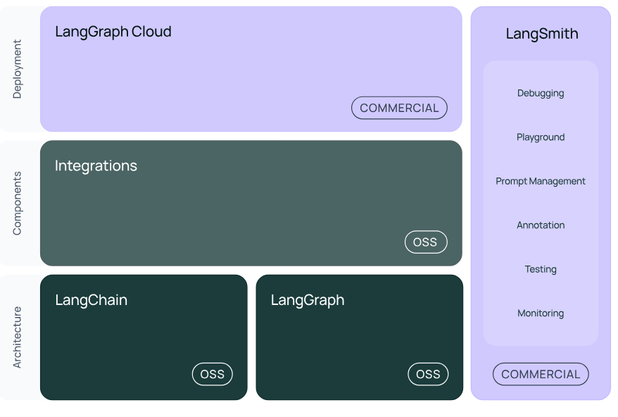

# LangChain and LangGraph Tutorials
Notebooks to teach you LangChain and LangGraph tutorials in simple terms. These are my own experience working with the tools related to these.
These tools are highly important for developing RAGs and conversation orchestrations.

