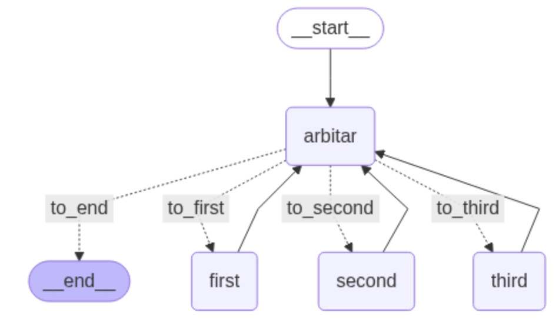

# Judge Simulation App
This project leverges the power of LLMs to simulate a courtroom where a judge (arbiter) ask suspects questions about a conviction of a crime that just happened. 

## Scenario
Two theives are teamed up to make the judge believe that the third suspect is a criminal and get away with rubbery they commited. The judge, however, should find the guilty one and avoid being fooled by the misleading statements. The third speaker also need to stand tall, defend himself, and avoid any accusations.

(for the ease of provision, I called these suspect as first, second and third)

The flow of speaking is given as graph shown below where first the arbiter manages the turn for each speaker and after a few iterations, notify the final verdit.



At first (during the first round/turn of talks), the judge allows all parties speak and leave their statement, then he calls each of these suspect at the podium for answering questions. To avoid all the LLM unnecessary outputs (like introductions, mentioning what is done, etc.), and only and directly target the speakers, it is needed to use `pydantic` tool to fetch the absolute speaker that the judge wants to clarify a statement for. This step is so crucial as the next turn of talk should be handed over to this speaker for leaving comments/answering questions/clarifying statements.

## Results

- You can see sample outputs in `output` folder. At the end of each file, please read the final verdict that the judge issues. The results are stunning.

- There is also a notebook file where you can test different pieces of this project.

- To view the results on `langsmith`, put the followings in `.env` file:
```
LANGSMITH_TRACING=true
LANGSMITH_ENDPOINT="https://api.smith.langchain.com"
LANGSMITH_API_KEY= "<fill this>"
LANGSMITH_PROJECT="pr-ajar-making-75"

GROQ_API_KEY = "<fill this>"
```


## Undersranding

- I tried Ollama and Groq (Llam3) for this app. Groq, as was expected, was much faster than the Ollama (5 times faster than the Ollama running on my Mac pro 2015, 16 GB RAM, 2.2 GHz Quad-Core Intel Core i7).

- The power of misleading the judge is shocking as suspects are so powerful in fooling the judge and twisting the case. At the same time, judge is meticulously finding the case out and pinpoint the guily one based on their statements.

- No evidence is given in this round of judgement. Maybe, if a few evidence is given to the judge, including alibis of each suspect at the time of rubbery of such, the final verdict much have been more rantionale.

